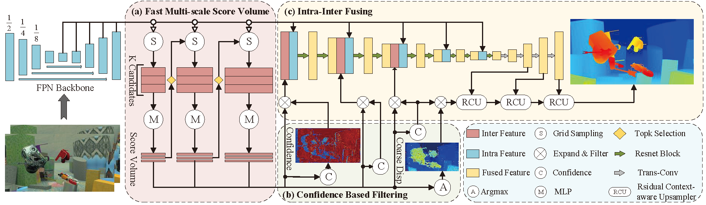

## IInet

This repository contains the code for AAAI 2024 paper `IINet: Implicit Intra-inter Information Fusion for Real-Time Stereo Matching`
[paper-link](https://ojs.aaai.org/index.php/AAAI/article/download/28107/28218)




## Requirements

### Environments

1. Python 3.8
2. CUDA 10.3
3. PyTorch 1.11.0
### Packages
    matplotlib antialiased-cnns opencv-python progressbar2 timm==0.6.5 tensorboardX h5py kornia pypng


## Pretrained Weights

- **SceneFlow Pre-trained Weights** [[google drive]](https://drive.google.com/file/d/1Jnq2vpmldAmzwUxoM83OWU87pDIYFGjs/view?usp=sharing)
- **Spring Pre-trained Weights** [[google drive]](https://drive.google.com/file/d/1VImTxmBh5SgDQJQ32S0XSvajKh5Jx8UF/view?usp=sharing)

       
## Dataset
**Sceneflow dataset**  
Download the *finalpass* data of the [Sceneflow dataset](https://lmb.informatik.uni-freiburg.de/resources/datasets/SceneFlowDatasets.en.html) as well as the *Disparity* data.

**Spring dataset**  
Download [Spring dataset](https://darus.uni-stuttgart.de/dataset.xhtml?persistentId=doi:10.18419/darus-3376) ,
and unzip *train/test_frame_left/right.zip*, *train_disp1_left/right.zip*.

The datasets are organized as follows
```
└── datasets
    ├── spring
    |   ├── test
    |   │   ├── 0003
    |   │   ├── 0019
    |   |       :
    |   |
    |   ├── train
    |   │   ├── 0001
    |   │   └── 0002
    |   |       :    
    |
    └── sceneflow
        ├── disparity
        │   ├── TEST
        │   │     ├──A
        │   │     ├──B
        │   │     └──C  
        │   └── TRAIN
        │         ├──15mm_focallength
        │              :
        │         ├──a_rain_of_stones_x2
        │              :
        │         └──A             
        ├── frames_finalpass
            ├── TEST
            │     ├──A
            │     ├──B
            │     └──C           
            └── TRAIN
                  ├──15mm_focallength
                      :   

```

## Eval on Sceneflow or Spring
Set **dataset_path** in *'configs/data/sceneflow.yaml'* and **load_weights_fron_checkpoint** in
*'./scripts/eval_sceneflow.sh'*. Then run:

    bash scripts/eval_sceneflow.sh
    bash scripts/eval_spring.sh

## Train on Sceneflow
Set **dataset_path** in *'configs/data/sceneflow.yaml'*. Then run:

    bash scripts/train_sceneflow.sh

## Finetune on Spring
After training the model on Sceneflow, there will be saved checkpoints in 
*'./run/sceneflow/expname/models'*. Set **load_weights_from_checkpoint** in 
*'./scripts/finetune_spring.sh'*. Then run:

    bash scripts/finetune_spring.sh

## Test Latency
Run the script, and the gpu latency will be tested using torch.profiler. The screen outputs
show the total latency of 3 forward process. Two files will be generated, **torch_cuda_stack.json** and
**torch_cpu_stack.json**, which can be further loaded to [speedscope](https://www.speedscope.app/) to 
show latency of each module.

    bash scripts/test_speed.sh
## Citation

If you find our work useful in your research, please consider citing our paper

    @inproceedings{li2024iinet,
      title={IINet: Implicit Intra-inter Information Fusion for Real-Time Stereo Matching},
      author={Li, Ximeng and Zhang, Chen and Su, Wanjuan and Tao, Wenbing},
      booktitle={Proceedings of the AAAI Conference on Artificial Intelligence},
      volume={38},
      number={4},
      pages={3225--3233},
      year={2024}
    }

## Acknowledgements

Part of the code is adopted from previous works: [Simplerecon](https://github.com/nianticlabs/simplerecon), [STTR](https://github.com/mli0603/stereo-transformer)


